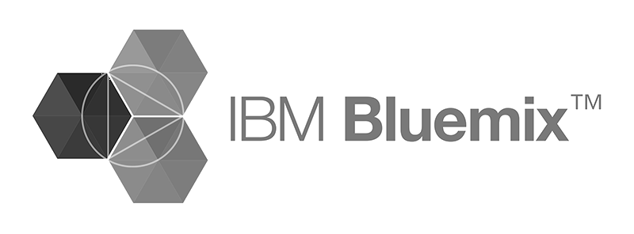
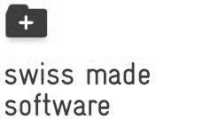

---

title: About us

---

# About us

*4Quant* is a Spin-off of [ETH Zurich](https://www.ethz.ch/de.html) and the [Paul Scherrer Institut](https://www.psi.ch/) based on the [PhD Thesis]() of [Kevin Mader](https://ch.linkedin.com/in/kevinmader) done in the [X-Ray Microscopy Laboratory of Marco Stampanoni](https://www.psi.ch/lsb-tomography/x-ray-tomography-group).

We are funded by the [Pioneer Fellowship](https://www.ethz.ch/en/research/research-promotion/eth-internal-programmes/pioneer-fellowships.html) of the ETH Zurich and a member of the [ETH Innovation and Entrepreneurship Lab](https://www.ethz.ch/en/industry-and-society/innovation-and-setting-up-companies/ielab.html). We are built on a strong foundation of partnerships ranging from the [IBM Global Entrepreneur Program](https://www-01.ibm.com/software/info/ecod/cloudoffer/startup.html) and [Databricks](https://databricks.com/) for Cloud Support to [SLS Techno Trans AG](https://www.psi.ch/sls-techno-trans-ag/) for access to the latest generation of imaging techniqes.

We are committed to Open Source and have many of our projects available on [Github](https://github.com/4Quant) and we push many of our latest developments back to the core project so the entire community can benefit from our developments.

# Customers

todo (logos im google drive)
https://www.evernote.com/l/AJmcllRKo1JOk7of4utrDFMx4-mjUCXp7HE

# Partner

    

      
    

    

      
    

    

      
    

    

      
    

    

      
    

# Affiliations

    

      
    

    

      
    

    

      
    

    

      
    

    

      
    

# Get in touch

You can get in touch via <a href='mailto&#58;&#105;&#37;&#54;&#69;&#102;&#111;&#64;4&#37;71u%&#54;1nt&#46;com'>email</a>, [Twitter](https://twitter.com/4quant), [Linkedin](https://www.linkedin.com/company/4quant) or [Facebook](https://www.facebook.com/4quant/).

4Quant Ltd. 
Binzmühlestrasse 56 
CH-8050 Zurich 

<a href='mailto&#58;&#105;&#37;&#54;&#69;&#102;&#111;&#64;4&#37;71u%&#54;1nt&#46;com'>&#105;n&#102;&#111;&#64;4&#113;uan&#116;&#46;&#99;&#111;m</a> 
CHE-168.792.194 

