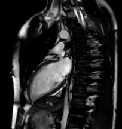

---

---

# Improving Surgery and Radiotherapy with Real-time Analysis

## Problem: Static prescan images are a poor guide for treatment

The standard procedure for both radiotherapy and surgery involves making scans and planning treatment prior to the operation. In the mean time, organs can shift, the patient breaths, and occasionally the alignment during the scan and operation do not match completely. For many situations these shifts are not important, but around sensitive organs and small tumors these can mean the difference between recovery and relapse.

## Solution: Real-time Imaging and Segmentation

The latest surgical suites and MRI technologies have made subsecond measurements a reality. These measurements are already being used to assist therapy, but the value is limited without the ability to process the images in real-time.

||```SELECT Image as ChestCT FROM PatientImages WHERE Modality="CT" AND Region="Chest"```|
||Perform Segmentation ```SELECT CHEST_SEGMENTATION(Image) as ChestSeg FROM ChestCT```|
||Extract the heart since it is the most dose-sensitiv ```SELECT CHEST_SEGMENTATION(Image) as ChestSeg FROM ChestCT```|
